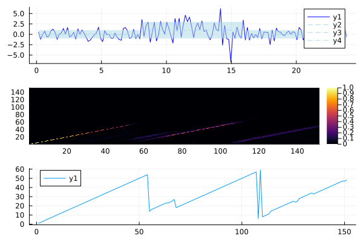

# Bayesian Online ChangePoint

An implementation of [BOCP](https://arxiv.org/abs/0710.3742) in Julia.  

This is presently under construction. The intention is to take in a datastream and infer the changepoints and run lengths. 
For example, producing plots like the following:

